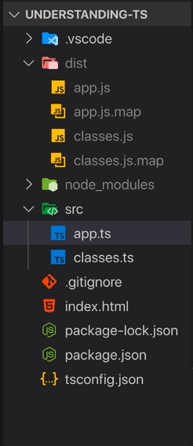

# TypeScript Overview

[Official Docs](https://www.typescriptlang.org/docs/)

- Note, this repo will have a number of .js files
- The rule is that since these are compiled files, they shouldn't be included
- But this isn't a 'project' per-say, and they are helpful for learning
- [Feature Parity List](https://kangax.github.io/compat-table/es6/)

## What is TypeScript

1. A JavaScript Superset
   - Built up on JS
   - Adds new features and advantages
1. Browser's can't execute TS (need a compiler!)
   - Neither can Node
   - So we compile TS to JS (built in)
1. TS compiler builds features to js 'workarounds'
   - Possbile errors are possible
1. Adds 'types' to JS
   - Fixes type 'runtime' errors to compile errors
1. Compiler generates js that works in older browsers
   - Can use modern js
1. Access to non-js features
   - Interfaces, Generics, Decorators

## Install TypeScript

1. [TypeScript Site](https://www.typescriptlang.org/#installation)
1. [Install Node](https://nodejs.org/en/)
1. Run
   ```cmd
   npm install -g typescript
   ```
1. Compile ts file to js
   ```cmd
   tsc file.ts
   ```

## Project Setup



- Notice that ts files are your source and js are your compiled code
- We don't want to store compiled code in source control

# TypeScript Types

[Official Docs](https://www.typescriptlang.org/docs/handbook/basic-types.html)

## Core Types

1. number
   - Only one number type (js thing)
1. string
   - All text values
1. boolean
   - No truthy or falsy
1. object
1. Array
1. Tuple

**Core primitives are always lowercase**

## Object Types

TypeScript creates a key/type pair when you define an object

```ts
const person = {
	name: 'Gary',
	age: 31,
};
```

```ts
const person: {
	name: string;
	age: number;
};
```

## Type Aliases

Define Object

```ts
type User = { name: string; age: number };
const u1: User = { name: 'Max', age: 30 }; // this works!
```

Function Simplification

```ts
function greet(user: { name: string; age: number }) {
	console.log('Hi, I am ' + user.name);
}

function isOlder(user: { name: string; age: number }, checkAge: number) {
	return checkAge > user.age;
}

type User = { name: string; age: number };

function greet(user: User) {
	console.log('Hi, I am ' + user.name);
}

function isOlder(user: User, checkAge: number) {
	return checkAge > user.age;
}
```

# TypeScript Compiler

**Note:** If you run tsc 'file' it will ignore the config settings

You must run just tsc

1. Using 'Watch' mode
   - Hate recompiling your ts to js after every change?
   ```cmd
   tsc app.ts -w
   ```
   - Have to specifically target your file
1. Compiling entire project
   ```cmd
   tsc --init
   ```
   - Creates a tsconfig.json
   - Allows you to just type:
     ```cmd
     tsc
     ```
   - Compiles all ts files in your folder
   - Can be combined w/ watch mode
     ```cmd
     tsc -w
     ```
1. Including & Excluding files
   - Reference tsconfig.json
   - Goes after compiler options
   - "exclude": ["node_modules"]
     - node_modules is excluded as a default option
   - "include": []
     - Anything NOT in included won't be compiled
   - Compile include - exclude
   - "files": []
     - Like include, but can't set folders, just files
1. Compilation Target
   - Default is es5 (works in older browsers)
   - But you can change it
1. Core Libraries
   - "lib": ["dom", "es6", "dom.iterable", "scripthost"]
   - If not set, it uses defaults based on target (es6)
     - Would be all the global defaults from es6
1. Allow JS and Check JS
   - Does typescript compilation and checking for vanilla js
1. sourceMap
   - Turning on allows you to debug ts files in browser
1. outDir & rootDir
   - **This is where you'd want to set src and dist**
   - outDir for dist
   - rootDir for src (compiler only looks there)

# TypeScript Under the Covers

## Classes & Interfaces

1. [Classes](https://developer.mozilla.org/en-US/docs/Web/JavaScript/Reference/Classes)
1. [Interfaces](https://www.typescriptlang.org/docs/handbook/interfaces.html)

## Advanced Types

1. [Advanced Types](https://www.typescriptlang.org/docs/handbook/advanced-types.html)

## Generics

1. [Generics](https://www.typescriptlang.org/docs/handbook/generics.html)
