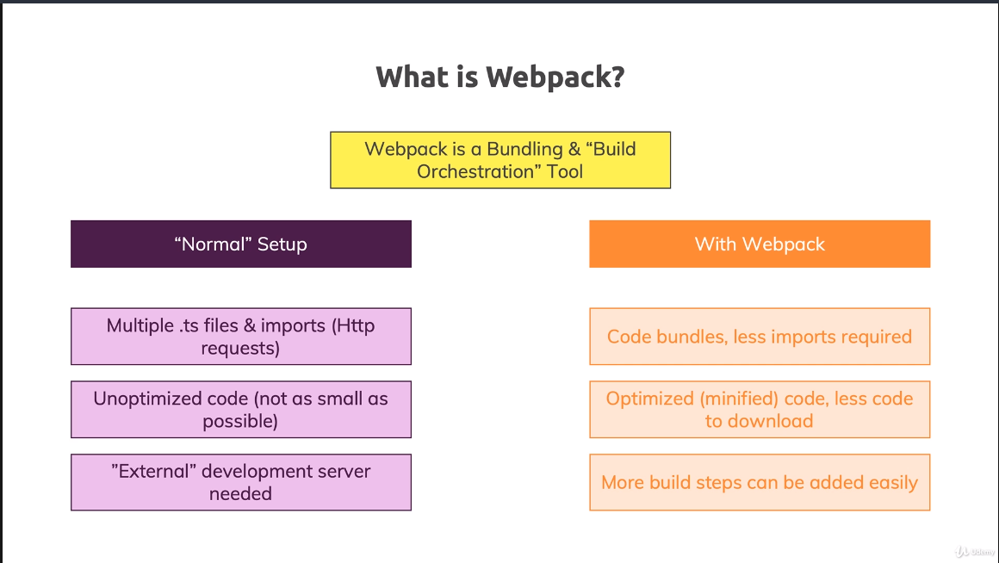

# TypeScript Overview

[Official Docs](https://www.typescriptlang.org/docs/)

- Note, this repo will have a number of .js files
- The rule is that since these are compiled files, they shouldn't be included
- But this isn't a 'project' per-say, and they are helpful for learning
- [Feature Parity List](https://kangax.github.io/compat-table/es6/)

## What is TypeScript

1. A JavaScript Superset
   - Built up on JS
   - Adds new features and advantages
1. Browser's can't execute TS (need a compiler!)
   - Neither can Node
   - So we compile TS to JS (built in)
1. TS compiler builds features to js 'workarounds'
   - Possbile errors are possible
1. Adds 'types' to JS
   - Fixes type 'runtime' errors to compile errors
1. Compiler generates js that works in older browsers
   - Can use modern js
1. Access to non-js features
   - Interfaces, Generics, Decorators

## Install TypeScript

1. [TypeScript Site](https://www.typescriptlang.org/#installation)
1. [Install Node](https://nodejs.org/en/)
1. Run
   ```cmd
   npm install -g typescript
   ```
1. Compile ts file to js
   ```cmd
   tsc file.ts
   ```

## Project Setup


- Notice that ts files are your source and js are your compiled code
- We don't want to store compiled code in source control

# TypeScript Types

[Official Docs](https://www.typescriptlang.org/docs/handbook/basic-types.html)

## Core Types

1. number
   - Only one number type (js thing)
1. string
   - All text values
1. boolean
   - No truthy or falsy
1. object
1. Array
1. Tuple

**Core primitives are always lowercase**

## Object Types

TypeScript creates a key/type pair when you define an object

```ts
const person = {
	name: 'Gary',
	age: 31,
};
```

```ts
const person: {
	name: string;
	age: number;
};
```

## Type Aliases

Define Object

```ts
type User = { name: string; age: number };
const u1: User = { name: 'Max', age: 30 }; // this works!
```

Function Simplification

```ts
function greet(user: { name: string; age: number }) {
	console.log('Hi, I am ' + user.name);
}

function isOlder(user: { name: string; age: number }, checkAge: number) {
	return checkAge > user.age;
}

type User = { name: string; age: number };

function greet(user: User) {
	console.log('Hi, I am ' + user.name);
}

function isOlder(user: User, checkAge: number) {
	return checkAge > user.age;
}
```

# TypeScript Compiler

**Note:** If you run tsc 'file' it will ignore the config settings

You must run just tsc

1. Using 'Watch' mode
   - Hate recompiling your ts to js after every change?
   ```cmd
   tsc app.ts -w
   ```
   - Have to specifically target your file
1. Compiling entire project
   ```cmd
   tsc --init
   ```
   - Creates a tsconfig.json
   - Allows you to just type:
     ```cmd
     tsc
     ```
   - Compiles all ts files in your folder
   - Can be combined w/ watch mode
     ```cmd
     tsc -w
     ```
1. Including & Excluding files
   - Reference tsconfig.json
   - Goes after compiler options
   - "exclude": ["node_modules"]
     - node_modules is excluded as a default option
   - "include": []
     - Anything NOT in included won't be compiled
   - Compile include - exclude
   - "files": []
     - Like include, but can't set folders, just files
1. Compilation Target
   - Default is es5 (works in older browsers)
   - But you can change it
1. Core Libraries
   - "lib": ["dom", "es6", "dom.iterable", "scripthost"]
   - If not set, it uses defaults based on target (es6)
     - Would be all the global defaults from es6
1. Allow JS and Check JS
   - Does typescript compilation and checking for vanilla js
1. sourceMap
   - Turning on allows you to debug ts files in browser
1. outDir & rootDir
   - **This is where you'd want to set src and dist**
   - outDir for dist
   - rootDir for src (compiler only looks there)

# TypeScript Under the Covers

## Classes & Interfaces

1. [Classes](https://developer.mozilla.org/en-US/docs/Web/JavaScript/Reference/Classes)

   ```ts
   class Department {
   	//private name: string;
   	// js doesn't use 'private'
   	protected employees: string[] = [];

   	// shorthand initilalization
   	constructor(private readonly id: string, public name: string) {
   		//this.name = name;
   	}

   	describe(this: Department) {
   		console.log(`Department: (${this.id}) ${this.name}`);
   	}

   	addEmployee(employee: string) {
   		//this.id = 'd2'; readonly, can't do this
   		this.employees.push(employee);
   	}

   	printEmployeeInfo() {
   		console.log(this.employees.length);
   		console.log(this.employees);
   	}
   }

   // Can only inherit from one class
   class ITDepartment extends Department {
   	admins: string[];

   	constructor(id: string, admins: string[]) {
   		super(id, 'IT');
   		this.admins = admins; // this has to come after super
   	}
   }
   ```

1. [Interfaces](https://www.typescriptlang.org/docs/handbook/interfaces.html)

   ```ts
   interface Named {
   	readonly name: string;
   }

   // interfaces can extend other interfaces
   // can extend multiple, comma separated
   interface Greetable extends Named {
   	// can set read only on interface
   	readonly name: string;

   	greet(phrase: string): void;
   }

   // can implement multiple interfaces
   class Person implements Greetable {
   	name: string;
   	age = 31;

   	constructor(n: string) {
   		this.name = n;
   	}

   	greet(phrase: string): void {
   		console.log(`${phrase} ${this.name}`);
   	}
   }
   ```

## Advanced Types

1. [Advanced Types](https://www.typescriptlang.org/docs/handbook/advanced-types.html)

```ts
type Admin = {
	name: string;
	privileges: string[];
};

type Employee = {
	name: string;
	startDate: Date;
};

// Combining the types
// Similar to interface inheritance
// We can do this exact same thing w/ interfaces
type ElevatedEmployee = Admin & Employee;

const el: ElevatedEmployee = {
	name: 'Gary',
	privileges: ['create-server'],
	startDate: new Date(),
};
```

## Generics

1. [Generics](https://www.typescriptlang.org/docs/handbook/generics.html)

```ts
class DataStorage<T extends string | number | boolean> {
	private data: T[] = [];

	addItem(item: T) {
		this.data.push(item);
	}

	removeItem(item: T) {
		if (this.data.indexOf(item) === -1) {
			return;
		}
		this.data.splice(this.data.indexOf(item), 1);
	}

	getItems() {
		return [...this.data];
	}
}
```

## Decorators

1. [Decorators](https://www.typescriptlang.org/docs/handbook/decorators.html)
   - 'Meta Programming'
   - Meant for code that will be used by other devs
   - Makes it easier for those devs to use your code
   - They run when you define a class

```ts
// 0. Class Decorator
function Logger(logString: string) {
	console.log('Logger Factory');
	return function (constructor: Function) {
		console.log(logString);
		console.log(constructor);
	};
}

// 1. Property Decorator
function Log(target: any, propertyName: string) {
	console.log('Property decorator');
	console.log(target, propertyName);
}

// 2. Accessor Decorator
function Log2(target: any, name: string, descriptor: PropertyDescriptor) {
	console.log('Accessor decorator');
	console.log(target);
	console.log(name);
	console.log(descriptor);
}

// 3. Method Decorator
function Log3(
	target: any,
	name: string | Symbol,
	descriptor: PropertyDescriptor
) {
	console.log('Method decorator');
	console.log(target);
	console.log(name);
	console.log(descriptor);
}

function Log4(target: any, name: string | Symbol, position: number) {
	console.log('Parameter decorator');
	console.log(target);
	console.log(name);
	console.log(position);
}

@Logger('LOGGING - PERSON')
class Product {
	@Log
	title: string;
	private _price: number;

	@Log2
	set price(val: number) {
		if (val > 0) {
			this._price = val;
		} else {
			throw new Error('Invalid price - should be positive');
		}
	}

	constructor(t: string, p: number) {
		this.title = t;
		this._price = p;
	}

	@Log3
	getPriceWithTax(@Log4 tax: number) {
		return this.price * (1 + tax);
	}
}
```

# TypeScript Modular Code

1. [Modules Overview](https://medium.com/computed-comparisons/commonjs-vs-amd-vs-requirejs-vs-es6-modules-2e814b114a0b)
1. [More on ES Modules](https://developer.mozilla.org/en-US/docs/Web/JavaScript/Guide/Modules)

## Splitting Code into Multiple Files

1. Namespaces & File Bundling
   - Use 'namespace' code syntax to group code
   - Per-file or bundled compilation is possible (less imports to manage)
1. ES6 Imports/Exports
   - ES6 Modules
   - Per-file compilation, but single script import

# Webpack

**Webpack server wasn't loading on my work machine (port issue maybe)**

I can just run the webpack build and use live server. Sucks since I have no 'watch' functionality that way

1. [Site Link](https://webpack.js.org/)
1. With a module based design, there's lots of http requests (loading all the .js files)
1. Webpack is a tool to help bundle our files together
   - Bundling & Build Orchestration



1. Needs a separate `webpack.config.js` file
1. Remove the .js extensions from import lines

# Third Party Libraries

1. Often you will find lots of useful libraries are only in JS
1. You often can install the 'types' of a package
   - Translations to ts of js libraries exist!
   - [lodash](https://github.com/DefinitelyTyped/DefinitelyTyped/tree/master/types/lodash)
1. What if you find a library that **doesn't** have types
